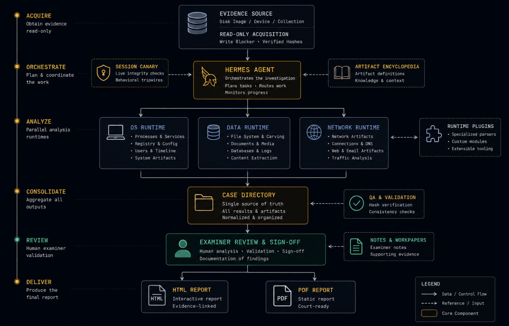

# Hermes Forensics Lab

> **AI-assisted digital forensics system built on Hermes Agent + SIFT Workstation**
>
> 12 forensic tools • 3 runtimes • automated validation • human-in-the-loop

[](https://github.com/NousResearch/hermes-agent)
[](#tool-inventory)
[](scripts/session-canary.sh)

---

## What It Looks Like

```text
$ hermes -p forensics

=== Forensics Session Canary ===
[docker:volatility3] PASS   [docker:plaso] PASS   [docker:mft-tools] PASS
[sift:sleuthkit] PASS       [sift:foremost] PASS   [sift:dc3dd] PASS
[sift:photorec] PASS        [sift:ddrescue] PASS   [sift:regripper] PASS
[sift:hashdeep] PASS        [sift:tshark] PASS
12/12 tools operational ✓

Agent: Mounting memory dump...
/mnt/mem/sys/proc/  → 97 processes
/mnt/mem/forensic/findevil.txt → 3 suspicious modules

Agent: Cross-validating with volatility3 malfind...
✓ 2 of 3 modules confirmed malicious

[DRAFT] F-niel-001  |  Cobalt Strike Beacon detected in lsass.exe
Confidence: HIGH  |  Tool: MemProcFS 5.17.8 + volatility3 2.7.0
Evidence: EVID-003  |  Cross-validated: dual-tool corroborated

Awaiting examiner approval. All findings held as DRAFT.
```

---

## Quick Start

### 1. Clone
```bash
git clone https://github.com/jayelbotvibe-web/hermes-forensics-lab.git
cd hermes-forensics-lab
```

### 2. Build Docker images
```bash
docker build -t forensics-volatility3:2.7.0 tools/volatility/
docker build -t forensics-plaso:20240512 tools/plaso/
docker build -t forensics-mft-tools:1.2.0.0 tools/mft-tools/
```

### 3. Install MemProcFS
```bash
wget https://github.com/ufrisk/MemProcFS/releases/latest -O memprocfs.tar.gz
tar xzf memprocfs.tar.gz
sudo apt install -y libfuse2t64 lz4
```

### 4. Set up SIFT VM
See [SETUP.md](SETUP.md) for full provisioning instructions.

### 5. Start the agent
```bash
hermes -p forensics
```

---

## Architecture



**[→ Full interactive version](index.html)**

---

## Tool Inventory

| # | Tool | Runtime | Version | Primary Use |
|---|------|---------|---------|-------------|
| 1 | **MemProcFS** | 💻 Host | 5.17.8 | Memory analysis (filesystem mount) |
| 2 | volatility3 | 🐳 Docker | 2.7.0 | Memory analysis (Linux dumps, cross-val) |
| 3 | plaso | 🐳 Docker | 20240512 | Super timeline generation |
| 4 | mft-tools | 🐳 Docker | 1.2.0.0 | MFT parsing (analyzeMFT) |
| 5 | sleuthkit | 🖥️ SIFT | 4.11.1 | Filesystem forensics |
| 6 | foremost | 🖥️ SIFT | 1.5.7 | File carving |
| 7 | photorec | 🖥️ SIFT | 7.1 | File carving (different sig DB) |
| 8 | dc3dd | 🖥️ SIFT | 7.3.1 | Forensic imaging |
| 9 | ddrescue | 🖥️ SIFT | 1.27 | Damaged media imaging |
| 10 | regripper | 🖥️ SIFT | 3.0 | Registry analysis |
| 11 | hashdeep | 🖥️ SIFT | 4.4 | Evidence hashing |
| 12 | tshark | 🖥️ SIFT | 4.0 | Network capture analysis |

💻 = Host FUSE &nbsp; 🐳 = Docker &nbsp; 🖥️ = SIFT VM

---

## Hermes Agent Integration

This system runs as a **Hermes Agent profile** (`forensics`). The profile includes:

- **Persona**: Stability-first DFIR analyst — evidence-sovereign, verification-obsessed
- **9 Skills**: evidence-handling, memory-forensics, filesystem-forensics, mft-analysis, registry-analysis, timeline-analysis, file-carving, disk-imaging, system-context
- **Session canary**: Auto-validates all 12 tools on every session start
- **Tool catalog**: Version-pinned, fallback chains, known issues documented
- **Human-in-the-loop**: All findings DRAFT until examiner approves

### Skills

| Skill | Loads | Description |
|-------|-------|-------------|
| [system-context](skills/system-context/SKILL.md) | ⚡ Always | Full architecture map, tool locations, operational procedures |
| [evidence-handling](skills/evidence-handling/SKILL.md) | 📋 Per-case | Chain of custody, case creation, evidence registration |
| [memory-forensics](skills/memory-forensics/SKILL.md) | 🔍 Per-task | MemProcFS-first memory analysis + volatility3 fallback |
| [filesystem-forensics](skills/filesystem-forensics/SKILL.md) | 🔍 Per-task | Sleuth Kit — file listing, inode extraction, mactime |
| [mft-analysis](skills/mft-analysis/SKILL.md) | 🔍 Per-task | MFT parsing with analyzeMFT, timestomping detection |
| [registry-analysis](skills/registry-analysis/SKILL.md) | 🔍 Per-task | Registry hive analysis, persistence detection |
| [timeline-analysis](skills/timeline-analysis/SKILL.md) | 🔍 Per-task | Super timeline with plaso, fallback to mactime |
| [file-carving](skills/file-carving/SKILL.md) | 🔍 Per-task | foremost + photorec dual-tool carving |
| [disk-imaging](skills/disk-imaging/SKILL.md) | 🔍 Per-task | dc3dd/ddrescue imaging with hash verification |

⚡ Always = loaded every session &nbsp; 📋 Per-case = loaded on case open/close &nbsp; 🔍 Per-task = loaded on demand

### Coordination with Pentest Agent

A companion [pentest lab](https://github.com/jayelbotvibe-web/hermes-pentest-lab) can hand off evidence to the forensics agent:

```bash
# Pentest agent creates a handoff:
bash scripts/handoff.sh "Suspicious DC01 memory dump" /path/to/dump.mem HIGH

# Forensics agent picks it up on next session start
hermes -p forensics
```

---

## Session Canary

Every session starts with automated tool validation:

```bash
bash scripts/session-canary.sh
```

Output:
```
=== Forensics Session Canary ===
[docker:volatility3] PASS
[docker:plaso] PASS
[docker:mft-tools] PASS
[sift:connectivity] PASS
[sift:sleuthkit] PASS
[sift:foremost] PASS
[sift:photorec] PASS
[sift:dc3dd] PASS
[sift:ddrescue] PASS
[sift:regripper] PASS
[sift:hashdeep] PASS
[sift:tshark] PASS
=== Results: 12 passed, 0 failed ===
✓ All tools operational
```

Failed tools are marked **DEGRADED** — triage-only, not for evidentiary analysis.

---

## Design Principles

| Principle | How |
|-----------|-----|
| Immutable tools | Docker images version-pinned, no `latest` tags |
| Session canary | All 12 tools validated before every investigation |
| Dual-tool cross-validation | Critical artifacts checked with 2 tools, delta >5% flagged |
| Evidence read-only | `chmod 444` after registration, chain of custody logged |
| Human-in-the-loop | All findings DRAFT until examiner approves |
| Never install mid-case | Missing tools flagged, not installed — no surprises |
| MemProcFS-first | Browse memory like a filesystem, volatility3 for fallback |

### MemProcFS-First Memory Analysis

Instead of memorizing 200+ volatility3 plugin names, the agent mounts the memory dump as a virtual filesystem and browses it:

```bash
memprocfs -device dump.mem -mount /mnt/mem -forensic 1
ls /mnt/mem/sys/proc/          # All processes as directories
cat /mnt/mem/sys/net/tcp.txt    # Network connections
cat /mnt/mem/forensic/findevil.txt  # Auto-detected malware
```

volatility3 remains as fallback for Linux dumps and cross-validation.

---

## 📁 Repo Structure

```
hermes-forensics-lab/
├── README.md                          ← you are here
├── SETUP.md                           ← SIFT VM provisioning guide
├── architecture.png                   ← system diagram
├── index.html                         ← interactive GitHub Pages
├── hermes-forensics.profile/          ← Hermes agent profile (config.yaml, persona)
├── scripts/
│   ├── session-canary.sh              ← validates all 12 tools on startup
│   ├── cross-validate.sh              ← dual-tool MFT verification
│   ├── sift-exec.sh                   ← SSH wrapper for SIFT VM tools
│   └── handoff.sh                     ← pentest → forensics evidence transfer
├── skills/
│   ├── system-context/SKILL.md        ← full architecture map (loaded always)
│   ├── evidence-handling/SKILL.md     ← chain of custody, case creation
│   ├── memory-forensics/SKILL.md      ← MemProcFS + volatility3 workflow
│   ├── filesystem-forensics/SKILL.md  ← Sleuth Kit analysis
│   ├── mft-analysis/SKILL.md          ← MFT parsing, timestomping detection
│   ├── registry-analysis/SKILL.md     ← registry hive analysis
│   ├── timeline-analysis/SKILL.md     ← super timeline with plaso
│   ├── file-carving/SKILL.md          ← foremost + photorec recovery
│   └── disk-imaging/SKILL.md          ← dc3dd/ddrescue acquisition
├── tools/
│   ├── tool-catalog.yaml              ← version pins, fallback chains, known issues
│   ├── volatility/
│   │   ├── Dockerfile                 ← volatility3 2.7.0
│   │   └── validate.sh
│   ├── plaso/
│   │   ├── Dockerfile                 ← plaso 20240512
│   │   └── validate.sh
│   └── mft-tools/
│       ├── Dockerfile                 ← analyzemft 2.1.0
│       └── validate.sh
└── fixtures/                          ← validation test images
```

---

## 📊 Finding Pipeline

```
Evidence Registration → Tool Execution → Cross-Validation → DRAFT Finding → Examiner Approval
       ↓                    ↓                  ↓                ↓                ↓
   hash + chmod         tool + version    delta check      F-niel-NNN     status → approved
   evidence.json        exact command      >5% flagged     confidence     audit trail
```

### What every finding includes:

| Field | Example | Why |
|-------|---------|-----|
| Finding ID | `F-niel-001` | Traceable reference |
| Tool + version | `volatility3 2.7.0` | Reproducible |
| Exact command | `vol -f dump.mem windows.pslist` | Verifiable |
| Evidence ref | `EVID-003` | Chain of custody |
| Confidence | `HIGH` (dual-tool) / `MEDIUM` / `LOW` / `TENTATIVE` | Reliability signal |
| Cross-validation | `analyzeMFT ↔ MFTECmd, delta 2.1%` | Corroboration |
| MITRE ATT&CK | `T1055.001` (if applicable) | Threat context |

### Finding statuses:
- **DRAFT** — AI-generated, awaiting examiner review
- **APPROVED** — Human examiner confirmed
- **REJECTED** — False positive or insufficient evidence
- **SUPERSEDED** — Replaced by a newer finding

All findings remain DRAFT until a human examiner approves them.
Every status change is logged to the case audit trail.

---

## 🆚 Traditional DFIR vs Hermes Forensics

| Aspect | Traditional DFIR | Hermes Forensics |
|--------|-----------------|------------------|
| Tool validation | Manual — hope tools still work | Session canary — auto-validates all 12 tools |
| Memory analysis | Memorize 200+ volatility3 plugin names | Mount dump as filesystem, browse like a directory |
| Cross-validation | Manual — copy-paste between tools | `cross-validate.sh` — dual-tool, delta >5% flagged |
| Findings | Word doc, copy-paste screenshots | Structured DRAFT → APPROVED pipeline |
| Chain of custody | Separate log, often forgotten | Auto-logged to JSONL audit trail |
| Version tracking | "I think I used volatility3 2.something" | Tool + version + image hash on every finding |
| Pentest handoff | "Here's a USB stick I guess" | `handoff.sh` → auto-detected on session start |

---

## 🎓 Learning Path

1. **13Cubed** — https://www.youtube.com/@13Cubed (Windows forensics deep dives)
2. **SANS DFIR Posters** — https://www.sans.org/posters/ (cheat sheets for every artifact)
3. **Blue Team Labs Online** — https://blueteamlabs.online/ (hands-on DFIR challenges)
4. **Practice with MemProcFS** — mount a Windows memory dump and browse the filesystem
5. **Practice with SIFT VM** — run sleuthkit, foremost, and plaso on test disk images
6. **Build a sample case** — create `INC-YYYY-MMDD-NNNN/`, register evidence, produce DRAFT findings
7. **Get certified** — GCFA (GIAC), CHFI (EC-Council), or BTL1 (Blue Team Level 1)

---

## ⚠️ Legal

This toolkit is for **authorized forensic analysis only**. Evidence must be
acquired with proper legal authority (consent, warrant, court order, or
organizational policy). The authors assume no liability for improper use.

- **Chain of custody** must be maintained from acquisition to courtroom
- **Evidence sovereignty** — evidence is read-only after registration
- **Write-blocking** — always use hardware write-blockers for evidentiary imaging
- **Tool validation** — canary must pass before any tool output is considered evidentiary
- **Finding approval** — AI-generated findings are DRAFT; only the human examiner can approve
- **Local laws** — some jurisdictions require specific certifications or licenses for forensic analysis
- **Data retention** — follow your organization's evidence retention and destruction policies

Every case includes an audit trail. Every finding records the tool, version,
exact command, and examiner who approved it. If you cannot reproduce a finding,
you cannot present it.

---

## Requirements

- **Hermes Agent** (https://github.com/NousResearch/hermes-agent)
- **Docker** (on host, for volatility3, plaso, mft-tools)
- **SIFT Workstation VM** (Ubuntu 22.04 + forensic tools via apt)
- **VMware Workstation** or KVM/QEMU (for the VM)
- **libfuse2** (for MemProcFS)
- **SSH key auth** to SIFT VM

---

## Related

- [Hermes Pentest Lab](https://github.com/jayelbotvibe-web/hermes-pentest-lab) — companion offensive security agent
- [MemProcFS](https://github.com/ufrisk/MemProcFS) — memory process file system
- [SIFT Workstation](https://www.sans.org/tools/sift-workstation) — SANS forensic toolkit
- [Volatility3](https://github.com/volatilityfoundation/volatility3) — memory forensics framework

---

## License

MIT — toolkit and documentation. Individual tools retain their own licenses (GPL, AGPL, Apache 2.0).
