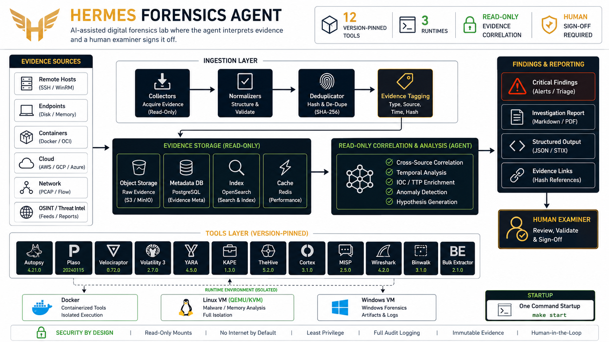
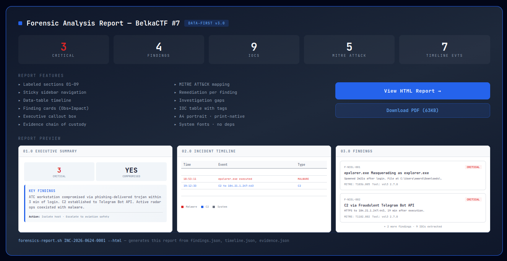

# Hermes Forensics Lab

> **AI-assisted digital forensics system built on Hermes Agent + SIFT Workstation**
>
> 12 forensic tools • 3 runtimes • 33-interpretation artifact encyclopedia • automated validation • cross-source correlation • human-in-the-loop

This is a **reproducible personal DFIR lab** and artifact-interpretation skill library. The full stack assumes a pre-built SIFT Workstation VM at a known IP, SSH key auth, Docker, and a Hermes Agent install. The artifact encyclopedia and skill library work standalone — use them without the tool runtime if you only need interpretation guidance.

[](https://github.com/NousResearch/hermes-agent)
[](#tool-inventory)
[](scripts/session-canary.sh)
[](#-artifact-knowledge-base-new)
[](docs/AUTOMATION.md)
[](https://github.com/jayelbotvibe-web/hermes-forensics-lab/blob/master/reports/samples/belkactf7-timeline-report.html)

---

> **🆕 v4.2.1 — Correlation Pass**
> Every finding is now cross-referenced against **independent sources** before the report is generated. The correlation engine extracts entities (IPs, hashes, filenames, domains) and proposes one of four verdicts: **CORROBORATED**, **SINGLE-SOURCE**, **CONTRADICTED**, or **UNVERIFIED**. Verdict badges render inline in both report templates. [See it in the sample report →](https://github.com/jayelbotvibe-web/hermes-forensics-lab/blob/master/reports/samples/belkactf7-data-report.pdf)

---

## What It Looks Like

```text
$ hermes -p forensics

=== Forensics Session Canary ===
[env:docker-daemon] PASS    [env:luks] PASS        [env:sift-ssh] PASS
[docker:volatility3] PASS   [docker:plaso] PASS    [docker:mft-tools] PASS
[host:memprocfs] PASS (v5.17.8)
[sift:sleuthkit] PASS       [sift:foremost] PASS   [sift:photorec] PASS
[sift:dc3dd] PASS           [sift:ddrescue] PASS   [sift:regripper] PASS
[sift:hashdeep] PASS        [sift:tshark] PASS

=== Canary Results ===
Tools:       12/12 operational
Environment: 8/8 ready
✓ All runtimes operational — ready for investigation

Agent: Mounting memory dump...
/mnt/mem/sys/proc/  → 97 processes
/mnt/mem/forensic/findevil.txt → 3 suspicious modules

Agent: Cross-validating with volatility3 malfind...
✓ 2 of 3 modules confirmed malicious

[DRAFT] F-niel-001  |  Cobalt Strike Beacon detected in lsass.exe
Confidence: HIGH  |  Tool: MemProcFS 5.17.8 + volatility3 2.7.0
Evidence: EVID-003

Awaiting examiner approval. All findings held as DRAFT.
```

---

## Architecture



**[→ Full interactive version](https://jayelbotvibe-web.github.io/hermes-forensics-lab/)**

> **TODO:** Record a terminal session demo (asciinema or GIF) showing a real run of `forensics-case.sh` through to report generation. This would be the strongest zero-setup proof of capability for visitors who can't install the full stack.

---

## 📊 Sample Report

A complete forensic analysis report generated from structured case data — **BelkaCTF #7: Compromised Air Traffic Control Workstation**.



**Design:** Data-first · labeled sections 01–09 · sidebar navigation · finding cards · data-table timeline · executive callout · A4 portrait print-native

[**→ View HTML Report**](https://htmlpreview.github.io/?https://github.com/jayelbotvibe-web/hermes-forensics-lab/blob/master/reports/samples/belkactf7-data-report.html) &nbsp;·&nbsp; [**Download PDF (69KB)**](reports/samples/belkactf7-data-report.pdf)

*Generated by `forensics-report.sh` from `findings.json` + `timeline.json` + `evidence.json`. Appendix references evidence screenshots in `case/raw/screenshots/`.*

---

## 🧠 Artifact Knowledge Base (New)

> **The agent now knows WHAT forensic artifacts mean — not just HOW to run the tools.**

A 25-interpretation artifact encyclopedia covering 6 categories. Every entry maps raw tool output → attacker behavior → MITRE ATT&CK technique → confidence tier → next investigative step.

```text
Agent sees: epxlorer.exe (PID 9920, PPID 5116, Wow64=True)

  📖 Consults artifact encyclopedia → Typo-Squatted Process Name
     "Single-character substitution of explorer.exe — T1036.005"
     Confidence: HIGH (user-writable path + Wow64 flag)

  📖 Consults → Browser Download Artifact
     "epxlorer.exe435568.crdownload — Chromium download marker"
     → T1566.001 (Spearphishing Attachment)
     Confidence: HIGH (proves browser-origin delivery)

  📖 Consults → Network Beaconing Pattern
     "104.21.1.247:443 from PID 9920 — outbound C2 channel"
     → T1071.001 (Web Protocols) + T1573 (Encrypted Channel)
     Confidence: HIGH (process + network correlation)
```

### Coverage

| Category | Entries | Example Artifacts |
|---|---|---|
| **Process** | 9 | ImagePath mismatch, typo-squatted names, Wow64 flag, process hollowing, svchost parent check, LOLBin command-lines |
| **Network** | 5 | Beaconing patterns, unusual ports, exfiltration volume, lateral SMB, DNS tunneling |
| **Registry** | 5 | Run key persistence, service persistence, scheduled tasks, RDP history, typed URLs |
| **Filesystem** | 6 | ADS detection, timestomp, hidden files, web shells, Prefetch anomalies, **browser download artifacts** (.crdownload, Zone.Identifier) |
| **MFT** | 4 | SI/FN timestamp mismatch, resident data hiding, deleted file recovery, UsnJrnl anomalies |
| **Memory** | 4 | Injected code (RWX), unlinked DLLs, malware mutexes, process-network C2 correlation |

Every entry includes: what you see → interpretation → MITRE ATT&CK → confidence tier → next step → cross-reference to investigation phase.

[**→ View full artifact encyclopedia**](skills/forensic-artifacts/SKILL.md)

*Tested against BelkaCTF #7: all 4 findings correctly interpreted. Found the typo-squatted process name (epxlorer.exe), browser download artifact (.crdownload), and C2 beacon — with correct MITRE mappings and confidence tiers.*

---

## Quick Start

### 1. Clone
```bash
git clone https://github.com/jayelbotvibe-web/hermes-forensics-lab.git
cd hermes-forensics-lab
```

### 2. Build Docker images
```bash
docker build -t forensics-volatility3:2.7.0 tools/volatility/
docker build -t forensics-plaso:20240512 tools/plaso/
docker build -t forensics-mft-tools:1.2.0.0 tools/mft-tools/
```

### 3. Install MemProcFS
```bash
# Fetch the latest MemProcFS Linux release asset dynamically
MEMPROCFS_URL=$(curl -s https://api.github.com/repos/ufrisk/MemProcFS/releases/latest \
  | grep browser_download_url \
  | grep -i 'linux' \
  | head -n1 \
  | cut -d '"' -f4)
curl -L "$MEMPROCFS_URL" -o memprocfs.zip
unzip memprocfs.zip -d memprocfs
sudo apt install -y libfuse2t64 lz4 unzip
```

### 4. Set up SIFT VM
See [SETUP.md](SETUP.md) for full provisioning instructions.

### 5. Start the agent
```bash
hermes -p forensics
```

---

## ⚡ One-Command Automation (New in v4.1)

> **Three commands replace the entire runbook.** Full docs: [AUTOMATION.md](docs/AUTOMATION.md)

```bash
# Bring everything online (~60s) — LUKS + SIFT VM + Docker + canary
bash scripts/forensics-up.sh

# Create a case with one command
CASE_ID=$(bash scripts/forensics-case.sh "BelkaCTF 7 — Memory Dump Analysis")

# Shut down cleanly when done
bash scripts/forensics-down.sh
```

**What `forensics-up.sh` does in one command:**
opens LUKS → starts SIFT VM → waits for SSH → checks Docker → runs session canary → reports ready

**See [AUTOMATION.md](docs/AUTOMATION.md) for troubleshooting common issues** (VM unreachable, LUKS mount failure, Docker down, canary failures).

---

## Tool Inventory

| # | Tool | Runtime | Version | Primary Use |
|---|------|---------|---------|-------------|
| 1 | **MemProcFS** | 💻 Host | 5.17.8 | Memory analysis (filesystem mount) |
| 2 | volatility3 | 🐳 Docker | 2.7.0 | Memory analysis (Linux dumps) |
| 3 | plaso | 🐳 Docker | 20240512 | Super timeline generation |
| 4 | mft-tools | 🐳 Docker | 1.2.0.0 | MFT parsing (analyzeMFT) |
| 5 | sleuthkit | 🖥️ SIFT | 4.11.1 | Filesystem forensics |
| 6 | foremost | 🖥️ SIFT | 1.5.7 | File carving |
| 7 | photorec | 🖥️ SIFT | 7.1 | File carving (different sig DB) |
| 8 | dc3dd | 🖥️ SIFT | 7.3.1 | Forensic imaging |
| 9 | ddrescue | 🖥️ SIFT | 1.27 | Damaged media imaging |
| 10 | regripper | 🖥️ SIFT | 3.0 | Registry analysis |
| 11 | hashdeep | 🖥️ SIFT | 4.4 | Evidence hashing |
| 12 | tshark | 🖥️ SIFT | 4.0 | Network capture analysis |

💻 = Host FUSE &nbsp; 🐳 = Docker &nbsp; 🖥️ = SIFT VM

---

## Hermes Agent Integration

This system runs as a **Hermes Agent profile** (`forensics`). 

- **`persona.md`** — The agent's identity and behavioral rules. Defines how the forensics agent thinks: evidence-sovereign, verification-obsessed, methodical. Sets the tone for all analysis output.
- **`hermes-forensics.profile/`** — Hermes profile configuration directory. Contains `config.yaml` which sets the terminal backend (local, so the agent can see host files), the model, approval mode (manual — human-in-the-loop), and delegation limits.

The profile includes:

- **Persona**: Stability-first DFIR analyst — evidence-sovereign, verification-obsessed
- **6 Skills**: evidence-handling, memory-forensics, filesystem-forensics, timeline-analysis, system-context (includes file-carving + disk-imaging), **forensic-artifacts (includes MFT + registry analysis)**
- **Session canary**: Auto-validates all tools on every session start
- **Tool catalog**: Version-pinned, fallback chains, known issues documented
- **Human-in-the-loop**: All findings DRAFT until examiner approves

### Skills

| Skill | Loads | Description |
|-------|-------|-------------|
| [system-context](skills/system-context/SKILL.md) | ⚡ Always | Full architecture map, tool locations, operational procedures, file carving + disk imaging workflows |
| [forensic-artifacts](skills/forensic-artifacts/SKILL.md) | 🔍 Per-task | **NEW** Artifact interpretation encyclopedia — 33 entries across 6 categories. Maps raw output → attacker behavior → MITRE ATT&CK. Also covers MFT + registry analysis workflows. |
| [evidence-handling](skills/evidence-handling/SKILL.md) | 📋 Per-case | Chain of custody, case creation, evidence registration |
| [memory-forensics](skills/memory-forensics/SKILL.md) | 🔍 Per-task | MemProcFS-first memory analysis + volatility3 fallback |
| [filesystem-forensics](skills/filesystem-forensics/SKILL.md) | 🔍 Per-task | Sleuth Kit — file listing, inode extraction, mactime |
| [timeline-analysis](skills/timeline-analysis/SKILL.md) | 🔍 Per-task | Super timeline with plaso, fallback to mactime |

⚡ Always = loaded every session &nbsp; 📋 Per-case = loaded on case open/close &nbsp; 🔍 Per-task = loaded on demand

### Coordination with Pentest Agent

A companion [pentest lab](https://github.com/jayelbotvibe-web/hermes-pentest-lab) can hand off evidence to the forensics agent:

```bash
# Pentest agent creates a handoff:
bash scripts/handoff.sh "Suspicious DC01 memory dump" /path/to/dump.mem HIGH

# Forensics agent picks it up on next session start
hermes -p forensics
```

---

## Session Canary

Every session starts with automated tool validation:

```bash
bash scripts/session-canary.sh
```

Output:
```
=== Forensics Session Canary ===
[env:docker-daemon] PASS
[env:luks] PASS (mounted)
[env:sift-ssh] PASS (172.16.146.128)
[env:dir-cases] PASS ... [env:dir-logs] PASS
[docker:forensics-volatility3:2.7.0] PASS
[docker:forensics-plaso:20240512] PASS
[docker:forensics-mft-tools:1.2.0.0] PASS
[host:memprocfs] PASS (v5.17.8)
[sift:sleuthkit] PASS
[sift:foremost] PASS
[sift:photorec] PASS
[sift:dc3dd] PASS
[sift:ddrescue] PASS
[sift:regripper] PASS
[sift:hashdeep] PASS
[sift:tshark] PASS
=== Canary Results ===
Tools:       12/12 operational
Environment: 8/8 ready
✓ All runtimes operational — ready for investigation
```

Failed tools are marked **DEGRADED** — triage-only, not for evidentiary analysis.

---

## Design Principles

| Principle | How |
|-----------|-----|
| Immutable tools | Docker images version-pinned, no `latest` tags |
| Session canary | All tools validated before every investigation |
| Artifact knowledge base | 25-interpretation encyclopedia maps raw output → meaning + MITRE ATT&CK |

| Evidence read-only | `chmod 444` after registration, chain of custody logged |
| Human-in-the-loop | All findings DRAFT until examiner approves |
| Never install mid-case | Missing tools flagged, not installed — no surprises |
| MemProcFS-first | Browse memory like a filesystem, volatility3 for fallback |

### MemProcFS-First Memory Analysis

Instead of memorizing 200+ volatility3 plugin names, the agent mounts the memory dump as a virtual filesystem and browses it:

```bash
memprocfs -device dump.mem -mount /mnt/mem -forensic 1
ls /mnt/mem/sys/proc/          # All processes as directories
cat /mnt/mem/sys/net/tcp.txt    # Network connections
cat /mnt/mem/forensic/findevil.txt  # Auto-detected malware
```

volatility3 remains as fallback for Linux dumps.

---

## 📁 Repo Structure

```
hermes-forensics-lab/
├── README.md                          ← you are here
├── SETUP.md                           ← SIFT VM provisioning guide
├── docs/
│   └── AUTOMATION.md                  ← automation scripts reference + troubleshooting
├── architecture.png                   ← system diagram
├── index.html                         ← interactive GitHub Pages
├── hermes-forensics.profile/          ← Hermes agent profile (config.yaml, persona)
├── scripts/
│   ├── forensics-up.sh                ← ⚡ one-command system bring-up
│   ├── forensics-down.sh              ← ⚡ clean system shutdown
│   ├── forensics-case.sh              ← ⚡ rapid case initialization
│   ├── forensics-verify.py            ← 🆕 correlation pass — read-only cross-reference advisor
│   ├── session-canary.sh              ← validates all tools on startup
│   ├── sift-exec.sh                   ← SSH wrapper for SIFT VM tools
│   └── handoff.sh                     ← pentest → forensics evidence transfer
├── skills/
│   ├── system-context/SKILL.md        ← full architecture map (loaded always)
│   ├── forensic-artifacts/SKILL.md    ← 🆕 artifact encyclopedia — 33 interpretations + MFT/registry workflows
│   ├── correlation/SKILL.md           ← 🆕 correlation pass — cross-reference findings against independent sources
│   ├── evidence-handling/SKILL.md     ← chain of custody, case creation
│   ├── memory-forensics/SKILL.md      ← MemProcFS + volatility3 workflow
│   ├── filesystem-forensics/SKILL.md  ← Sleuth Kit analysis
│   └── timeline-analysis/SKILL.md     ← super timeline with plaso
├── tools/
│   ├── tool-catalog.yaml              ← version pins, fallback chains, known issues
│   ├── volatility/
│   │   ├── Dockerfile                 ← volatility3 2.7.0
│   │   └── validate.sh
│   ├── plaso/
│   │   ├── Dockerfile                 ← plaso 20240512
│   │   └── validate.sh
│   └── mft-tools/
│       ├── Dockerfile                 ← analyzemft 2.1.0
│       └── validate.sh
└── fixtures/                          ← validation test images
```

---

## 📊 Finding Pipeline

```
Evidence Registration → Tool Execution → Correlation Pass → DRAFT Finding → Examiner Approval
       ↓                    ↓                  ↓                  ↓                ↓
   hash + chmod         tool + version    cross-source       F-niel-NNN     status → approved
   evidence.json        exact command     verdict check      confidence     audit trail
                                      CORROBORATED /
                                      SINGLE-SOURCE /
                                      CONTRADICTED /
                                      UNVERIFIED
```

### What every finding includes:

| Field | Example | Why |
|-------|---------|-----|
| Finding ID | `F-niel-001` | Traceable reference |
| Tool + version | `volatility3 2.7.0` | Reproducible |
| Exact command | `vol -f dump.mem windows.pslist` | Verifiable |
| Evidence ref | `EVID-003` | Chain of custody |
| Confidence | `HIGH` / `MEDIUM` / `LOW` / `TENTATIVE` | Encyclopedia match + canary status |
| Correlation verdict | `CORROBORATED` / `SINGLE-SOURCE` / `CONTRADICTED` / `UNVERIFIED` | Independent source verification |
| MITRE ATT&CK | `T1055.001` (if applicable) | Threat context |

### Finding statuses:
- **DRAFT** — AI-generated, awaiting examiner review
- **APPROVED** — Human examiner confirmed
- **REJECTED** — False positive or insufficient evidence
- **SUPERSEDED** — Replaced by a newer finding

All findings remain DRAFT until a human examiner approves them.
Every status change is logged to the case audit trail.

---

## 🔍 Correlation Pass (NEW in v4.2.1)

After findings are drafted, a **read-only cross-reference check** verifies each one against independent sources in the timeline and evidence registry. The correlation engine extracts entities (IPs, hashes, filenames, domains) from every finding and checks whether a **different tool** independently saw the same artifact.

### Four advisory verdicts

| Verdict | Means | Suggested Confidence |
|---|---|---|
| **CORROBORATED** | A different tool independently references the same entity | HIGH |
| **SINGLE-SOURCE** | Entity only appears in the finding's own tool output | LOW — examiner review |
| **CONTRADICTED** | Same filename carries two different SHA-256 hashes | REVIEW — possible substitution error |
| **UNVERIFIED** | No checkable entity could be extracted | Honest default |

### Key properties

- **Read-only** — never modifies findings, timeline, evidence, or the report
- **No REFUTED** — never deletes or dismisses a finding
- **Advisory only** — verdicts are proposals; the examiner decides
- **Independence required** — same tool twice is not corroboration
- **Renders in the report** — verdict badges appear inline in the findings table and a tally grid shows the full picture

```bash
# Run after analysis, before reporting
python3 scripts/forensics-verify.py /path/to/case_dir

# Reads:  findings.json + timeline.json + evidence.json
# Writes: correlation-proposals.json + correlation-summary.txt
```

Both report templates (timeline + data-first) render the correlation results automatically.

---

## 🆚 Traditional DFIR vs Hermes Forensics

| Aspect | Traditional DFIR | Hermes Forensics |
|--------|-----------------|------------------|
| Tool validation | Manual — hope tools still work | Session canary — auto-validates all tools |
| Artifact interpretation | Analyst memorizes artifact behavior patterns | 25-entry encyclopedia — maps output → meaning + MITRE ATT&CK |
| Memory analysis | Memorize 200+ volatility3 plugin names | Mount dump as filesystem, browse like a directory |
| Findings | Word doc, copy-paste screenshots | Structured DRAFT → APPROVED pipeline |
| Chain of custody | Separate log, often forgotten | Auto-logged to JSONL audit trail |
| Version tracking | "I think I used volatility3 2.something" | Tool + version + image hash on every finding |
| Pentest handoff | "Here's a USB stick I guess" | `handoff.sh` → auto-detected on session start |

---

## 🎓 Learning Path

1. **13Cubed** — https://www.youtube.com/@13Cubed (Windows forensics deep dives)
2. **SANS DFIR Posters** — https://www.sans.org/posters/ (cheat sheets for every artifact)
3. **Blue Team Labs Online** — https://blueteamlabs.online/ (hands-on DFIR challenges)
4. **Practice with MemProcFS** — mount a Windows memory dump and browse the filesystem
5. **Practice with SIFT VM** — run sleuthkit, foremost, and plaso on test disk images
6. **Build a sample case** — create `INC-YYYY-MMDD-NNNN/`, register evidence, produce DRAFT findings
7. **Get certified** — GCFA (GIAC), CHFI (EC-Council), or BTL1 (Blue Team Level 1)

---

## ⚠️ Legal

This toolkit is for **authorized forensic analysis only**. Evidence must be
acquired with proper legal authority (consent, warrant, court order, or
organizational policy). The authors assume no liability for improper use.

- **Chain of custody** must be maintained from acquisition to courtroom
- **Evidence sovereignty** — evidence is read-only after registration
- **Write-blocking** — always use hardware write-blockers for evidentiary imaging
- **Tool validation** — canary must pass before any tool output is considered evidentiary
- **Finding approval** — AI-generated findings are DRAFT; only the human examiner can approve
- **Local laws** — some jurisdictions require specific certifications or licenses for forensic analysis
- **Data retention** — follow your organization's evidence retention and destruction policies

Every case includes an audit trail. Every finding records the tool, version,
exact command, and examiner who approved it. If you cannot reproduce a finding,
you cannot present it.

---

## Requirements

- **Hermes Agent** (https://github.com/NousResearch/hermes-agent)
- **Docker** (on host, for volatility3, plaso, mft-tools)
- **SIFT Workstation VM** (Ubuntu 22.04 + forensic tools via apt)
- **VMware Workstation** or KVM/QEMU (for the VM)
- **libfuse2** (for MemProcFS)
- **SSH key auth** to SIFT VM

---

## Related

- [Hermes Pentest Lab](https://github.com/jayelbotvibe-web/hermes-pentest-lab) — companion offensive security agent
- [MemProcFS](https://github.com/ufrisk/MemProcFS) — memory process file system
- [SIFT Workstation](https://www.sans.org/tools/sift-workstation) — SANS forensic toolkit
- [Volatility3](https://github.com/volatilityfoundation/volatility3) — memory forensics framework

---

## License

MIT — toolkit and documentation. Individual tools retain their own licenses (GPL, AGPL, Apache 2.0).
